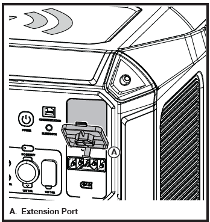
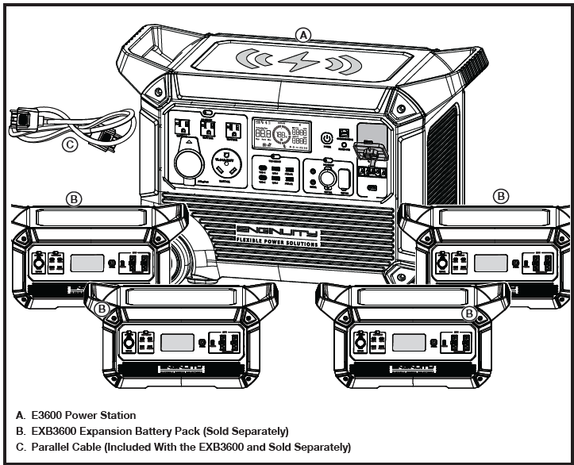

##TO EXPAND BATTERY CAPACITY
- Connect one end of a parallel cable (included with the EXB3600 and sold separately) to the extension port and the other end to an EXB3600 expansion battery
pack (sold separately) to increase the capacity of the power station by 3.686 kWh.
- Up to four EXB3600 expansion battery packs can be connected in parallel for a total of 14.744 additional kWh.
- Refer to the expansion battery pack(s) user manual for charging and operating instructions.
- To remove an expansion battery pack, disconnect the parallel cable from the power station.
>**NOTE: The parallel cable should be connected only when the E3600 power station and EXB3600 battery pack(s) are powered OFF.** If you connect or disconnect the parallel cable while the units are powered ON, they will automatically shut down within 10 seconds. To resume normal operation, turn the power station ON. Once the parallel cable is connected, all buttons and output panels on the battery pack(s) will be disabled. Controls and outputs must be accessed through the power station.

