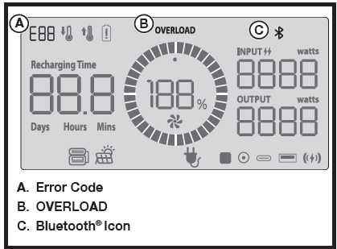

## OVERLOAD RESET
**Do not overload the power station!** Monitor the power station’s output. If the unit is nearing overload, turn the power station off. Remove one or more connected devices to decrease the load and resume normal operation. 
If the load is not reduced, the unit will reach an overload condition. To extend the life of the power station, avoid running the unit near capacity.
If the unit is overloaded or if there is a short circuit in a
connected device, an error code and/or the OVERLOAD
icon will appear in the display and the power station will
automatically stop discharging.

**To restore electrical output:**

- Remove all connected devices and turn the unit off.
- Turn the unit on and wait five seconds for the unit to initialize.
- Check the power requirements for the devices you want to power or charge. Ensure that the power requirements do not exceed the unit’s load capacity.
- Connect and charge devices as previously described.

