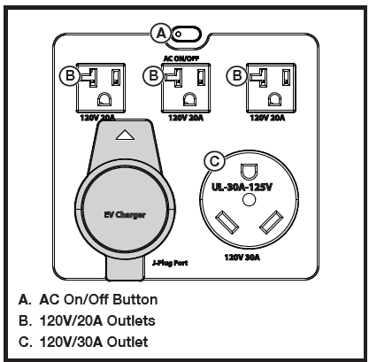

## TO USE THE AC RECEPTACLE
- Turn the unit on and wait five seconds for the unit to initialize.
- Press and release the AC on/off button to turn on AC power. The button’s indicator light will turn on when the AC receptacles are active.
- Plug the device or devices you want to power or charge into the power station’s AC receptacles.
- Press and release the AC on/off button to turn off AC power. AC power will automatically turn off in two hours if no load is detected.

