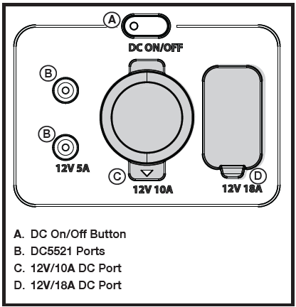

## TO USE THE DC OUTPUT

- Turn the unit on and wait five seconds for the unit to initialize.
- Press and release the DC on/off button to turn on DC power. The button’s indicator light will turn on when the DC output ports are active.
- Plug the device or devices you want to power or charge into the power station’s DC output port(s).
- Press and release the DC on/off button to turn off DC power. DC power will automatically turn off in two hours if no load is detected.

___

___

**BACK** - [Turn PS On Off](./E3600_Turn PS On Off.md)

**NEXT** - [DC Output Panel Protections](./E3600_DC Output Panel Protections.md)

**HOME** - [Table of Contents](./E3600_Table of Contents.md)

