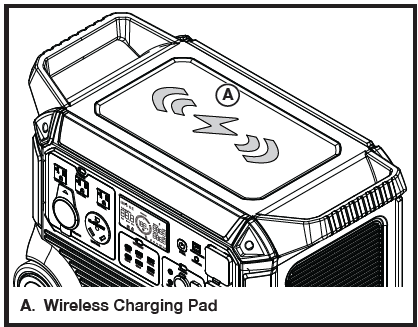

## TO USE WIRELESS CHARGING

- Turn the unit on and wait five seconds for the unit to
initialize.
- Press and release the USB on/off button to turn on wireless charging. The button’s indicator light will turn on when wireless charging is available.
- Place a compatible device on the wireless charging pad to begin charging.
- Press and release the USB on/off button to turn off wireless charging.

___

___

**BACK** - [UPS Functionality](./E3600_UPS Functionality.md)

**NEXT** - [Overload Reset](./E3600_Overload Reset.md)

**HOME** - [Table of Contents](./E3600_Table of Contents.md)
