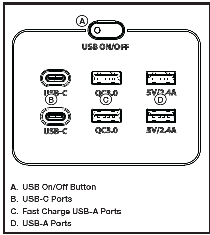

## TO USE THE USB PORTS
- Turn the unit on and wait five seconds for the unit to initialize.
- Press and release the USB on/off button to turn on USB power. The button’s indicator light will turn on when the USB ports are active.
- Plug the device or devices you want to power or charge into the power station’s USB ports.
> [!NOTE]
>
> The fast charge USB ports can charge and power most compatible electronic devices, including tablets and smartphones.

- Press and release the USB on/off button to turn off USB power. USB power will automatically turn off in two hours if no load is detected.

___

___

**BACK** - [DC Output Panel Protections](./E3600_DC_Output_Panel_Protections.md)

**NEXT** - [To Use AC Receptacle](./E3600_To_Use_AC_Receptacle.md)

**HOME** - [Table of Contents](./E3600_Table_of_Contents.md)

