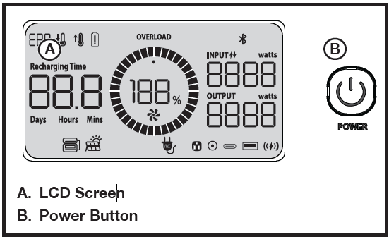

## TO TURN THE POWER STATION ON/OFF

- Press and hold the power button for two seconds to turn the unit on. This will activate the LCD screen and allow the DC port, AC receptacles and USB ports to be used.

> [!NOTE]
>
> If the unit is inactive for two hours, it will automatically turn off.

- To toggle the LCD screen off and on, press and release the power button quickly.
- To turn the unit off, press and hold the power button.

> [!NOTE]
>
> The unit can not be turned off while it is being charged.

___

___

**BACK** - [Using Your Power Station](./E3600_Using_Your_Power_Station.md)

**NEXT** - [To Use DC Output](./E3600_To_Use_DC_Output.md)

**HOME** - [Table of Contents](./E3600_Table_of_Contents.md)

