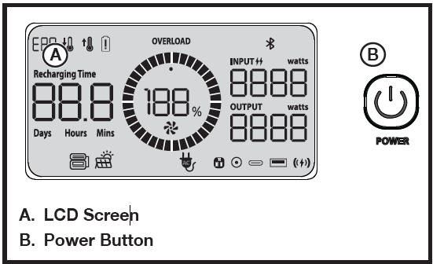
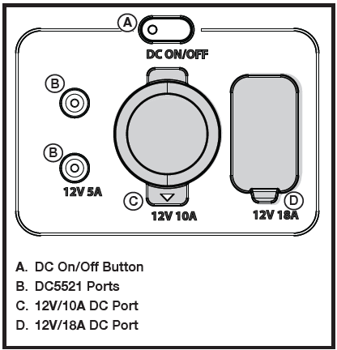
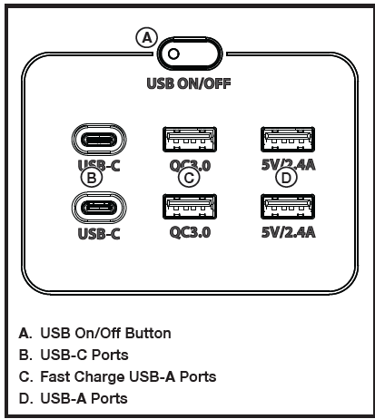
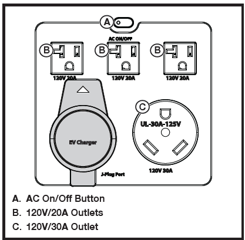
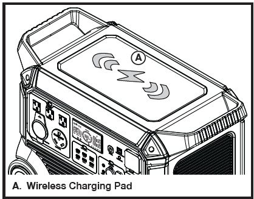
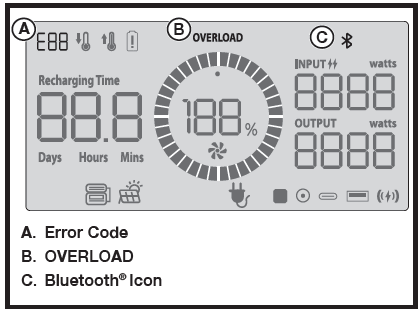
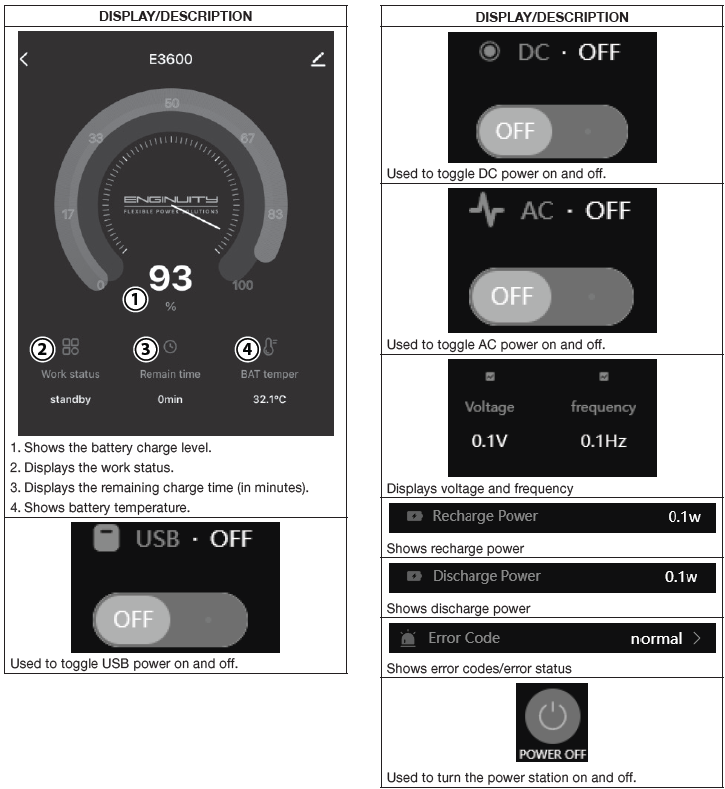
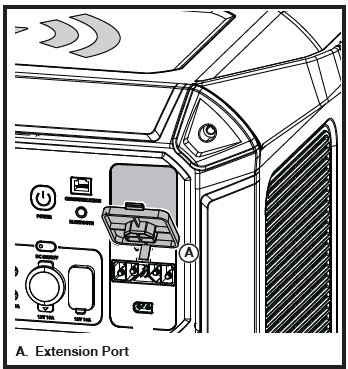
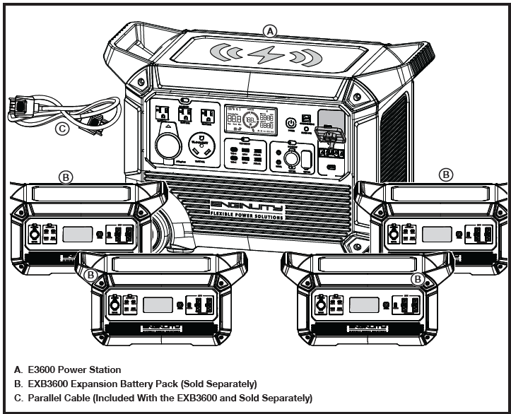

# USING YOUR POWER STATION

Once your power station is charged or while your power station is charging, it can be used to power other devices. Routinely monitor the power station’s battery charge level, discharge time, and load output during use.

> **NOTE:** If the AC receptacles are energized during AC charging, the power station’s internal batteries are bypassed and the connected devices recieve power directly from the grid. For details, see “UPS Functionality” later in this section.

**WARNING:** Do not overload the power station. Check the power requirements for all devices before connecting them to the power station. Power requirements are often listed on a device’s data label or nameplate. Exceeding the unit’s wattage/amperage capacity can damage the unit and/or electrical devices connected to it.

Some appliances and tools may have relatively low rated wattage but can draw inrush current 5 to 10 times higher than their nominal current during startup. The E3600 is designed to handle inrush currents up to 2 times of the E3600 rated output capacity. If an appliance exceeds this threshold, the unit’s overload protection will be triggered.

**WARNING:** Not all appliances under the E3600’s rated wattage are supported due to high inrush current. (Commonly seen high inrush current appliances: Miter saw, table saw, air compressor, MIG/TIG welder, refrigerator, etc.) If an overload occurs:

- **Do not attempt to restart the same appliance.**
- Repeated overload events may **permanently damage** the unit.
- Damage caused by misuse, including **continuous overloading, is not covered under warranty.**
---

## TO TURN THE POWER STATION ON/OFF

- Press and hold the power button for two seconds to turn the unit on. This will activate the LCD screen and allow the DC port, AC receptacles and USB ports tobe used.
> **NOTE:** If the unit is inactive for two hours, it will automatically turn off.
- To toggle the LCD screen off and on, press and release the power button quickly.
- To turn the unit off, press and hold the power button.
> **NOTE:** The unit can not be turned off while it is being charged.

## TO USE THE DC OUTPUT

- Turn the unit on and wait five seconds for the unit to initialize.
- Press and release the DC on/off button to turn on DC power. The button’s indicator light will turn on when the DC output ports are active.
- Plug the device or devices you want to power or charge into the power station’s DC output port(s).
- Press and release the DC on/off button to turn off DC power. DC power will automatically turn off in two hours if no load is detected.

## DC OUTPUT PANEL PROTECTIONS

The DC output panel is equipped with multiple protection features to ensure safe and reliable operation:
- **Short Circuit Protection**
	- Automatically shuts down the output if a short
circuit occurs.
	- Trigger threshold: **15A for 2 milliseconds.**
- **Overcurrent Protection**
	- Limits sustained high current draw to prevent damage.
	- Trigger threshold: **10A for 1 second.**
- **Low Voltage Protection**
	- Disconnects the DC output to prevent overdischarge of the battery.
	- Trigger threshold: **11V sustained for 5 seconds**.
- **No Backfeed Protection**
	- This system **does not support backfeed**. Connecting external power to the DC output may **permanently damage** the internal DC output control board.

**WARNING:** Do not connect any external voltage source to the DC output ports. **Backfeeding will void the warranty**.

## TO USE THE USB PORTS
- Turn the unit on and wait five seconds for the unit to initialize.
- Press and release the USB on/off button to turn on USB power. The button’s indicator light will turn on when the USB ports are active.
- Plug the device or devices you want to power or charge into the power station’s USB ports.
> **NOTE:**  The fast charge USB ports can charge and power most compatible electronic devices, including tablets and smartphones.
- Press and release the USB on/off button to turn off USB power. USB power will automatically turn off in two hours if no load is detected.

## TO USE THE AC RECEPTACLE
- Turn the unit on and wait five seconds for the unit to initialize.
- Press and release the AC on/off button to turn on AC power. The button’s indicator light will turn on when the AC receptacles are active.
- Plug the device or devices you want to power or charge into the power station’s AC receptacles.
- Press and release the AC on/off button to turn off AC power. AC power will automatically turn off in two hours if no load is detected.

## UPS FUNCTIONALITY

This power station has limited UPS functionality. When the power station is connected to grid power through the AC input port, you can power electrical devices through the AC ouput port. In this case, the AC power comes from the grid instead of the power station. If there is a blackout it will automatically begin energizing connected devices using energy stored in the internal batteries within 30ms.

**CAUTION:** This device does not provide 0ms switching. Do not connect devices that requires 0ms UPS, such as data servers and workstations, during AC charging.

## TO USE WIRELESS CHARGING

- Turn the unit on and wait five seconds for the unit to
initialize.
- Press and release the USB on/off button to turn on wireless charging. The button’s indicator light will turn on when wireless charging is available.
- Place a compatible device on the wireless charging pad to begin charging.
- Press and release the USB on/off button to turn off wireless charging.

## OVERLOAD RESET
**Do not overload the power station!** Monitor the power station’s output. If the unit is nearing overload, turn the power station off. Remove one or more connected devices to decrease the load and resume normal operation. 
If the load is not reduced, the unit will reach an overload condition. To extend the life of the power station, avoid running the unit near capacity.
If the unit is overloaded or if there is a short circuit in a
connected device, an error code and/or the OVERLOAD
icon will appear in the display and the power station will
automatically stop discharging.

**To restore electrical output:**

- Remove all connected devices and turn the unit off.
- Turn the unit on and wait five seconds for the unit to initialize.
- Check the power requirements for the devices you want to power or charge. Ensure that the power requirements do not exceed the unit’s load capacity.
- Connect and charge devices as previously described.

## TO USE THE COMMUNICATION PORT

The communication port will allow 2nd generation power stations to connect in parallel to the E3600.

## TO USE BLUETOOTH®

- Download the “Smart Life” app to your **Bluetooth®** enabled device using an app store or by scanning the QR code.
- Turn the power station on and wait five seconds for the unit to initialize.
- Press and hold the **Bluetooth®** button for two seconds. The unit will attempt to pair to a **Bluetooth®** enabled device or remote control.
> **NOTE:** The power station will automatically attempt to connect to the last device it was paired to. If a connection cannot be established within five seconds, the unit will make itself available to other **Bluetooth®** enabled devices.
> **NOTE:** The **Bluetooth®** icon will flash in the display while the power station searches for compatible devices. Once a device is paired, the icon will turn solid.
- **Bluetooth®** enabled devices must be within 32 ft. of the power station to pair with the unit.
- On the “Smart Life” app’s home page, tap the “+” in the upper right corner, then select “Add Device”. The **Bluetooth®** enabled device will find and pair with the power station automatically.
- Once paired, the device can be used to monitor and control the power station from a distance.
- To unpair the power station from the **Bluetooth®** enabled device, select the power station from the list of devices in the Smart Life App and select “Remove Device” in the bottom right hand corner.
> **NOTE:** When a new device is paired, the unit will automatically unpair from a connected device.

**UNDERSTANDING THE SMART LIFE APP**

**TO EXPAND BATTERY CAPACITY**
- Connect one end of a parallel cable (included with the EXB3600 and sold separately) to the extension port and the other end to an EXB3600 expansion battery
pack (sold separately) to increase the capacity of the power station by 3.686 kWh.
- Up to four EXB3600 expansion battery packs can be connected in parallel for a total of 14.744 additional kWh.
- Refer to the expansion battery pack(s) user manual for charging and operating instructions.
- To remove an expansion battery pack, disconnect the parallel cable from the power station.
>**NOTE: The parallel cable should be connected only when the E3600 power station and EXB3600 battery pack(s) are powered OFF.** If you connect or disconnect the parallel cable while the units are powered ON, they will automatically shut down within 10 seconds. To resume normal operation, turn the power station ON. Once the parallel cable is connected, all buttons and output panels on the battery pack(s) will be disabled. Controls and outputs must be accessed through the power station.

