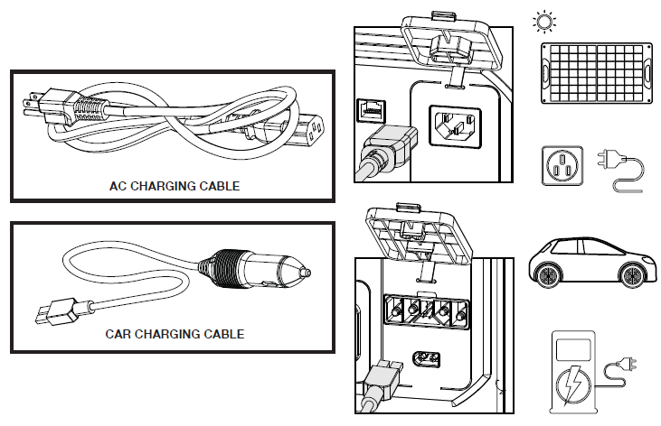

# CHARGING YOUR POWER STATION

The power station is shipped in a low charge condition. Using the AC charging cable, fully charge the power station before first use. The initial charge could take between 2 and 3 hours. Subsequent charge times will vary.
To avoid damaging the unit, only use cords that are provided or approved by the manufacturer to charge the power station. If desired, the power station can be used to power other devices while it is being charged. When the unit is both charging and discharging simultaneously, the recharging time is calculated based on the net power flow into the battery. This recharging time will be displayed on the LCD screen. If the discharge power exceeds the recharge power, the LCD will instead display the discharge time. Additionally, the “Smart Life” app (see page 11) will provide real-time data on both the recharge and discharge power for more accurate monitoring.
The unit has an extremely low standby power consumption. When left powered off, the battery level drops by only 1% over 30 days. When powered on with all output panels turned off, the battery level drops by approximately 1% every 1.5 hours.
During charging, the cooling fan will adjust its speed based on the internal temperature. It is normal to hear fan noise when the system is under thermal load.
If the AC charger remains connected after the battery is fully charged, the unit will not immediately resume charging. Charging will automatically restart only when the state of charge (SOC) drops below 95%. To conserve energy, the unit will automatically shut down if no output is detected for 2 hours.

___

___

**BACK** - [E3600_Specifications](./E3600_Specifications.md)

**NEXT** - [AC Charging](./E3600_AC_Charging.md)

**HOME** - [Table of Contents](./E3600_Table_of_Contents.md)

