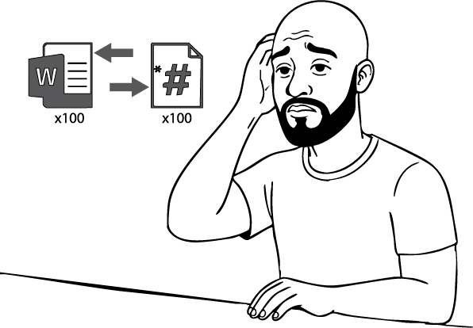

# WHY DO TECHNICAL WRITERS USE PYTHON?

Python is becoming increasingly valuable in **technical writing**, especially as the role evolves to include more automation, toolchain integration, and data-driven documentation. Tech writers use Python to:

- Automate repetitive tasks like bulk converting files (i.e. Word files to Markdown files), renaming and organizing documentation files, searching for and replacing content across multiple files
- Generate Markdown or HTML pages automatically from templates and metadata
- Ensure XML content conforms to a schema (such as DITA) prior to publication
- Format or lint Markdown and other plain text formats
- Creating internal tools that generate boilerplate docs or dashboards for doc versioning or status checks
- Making test API calls and documenting real responses
- And much more...

