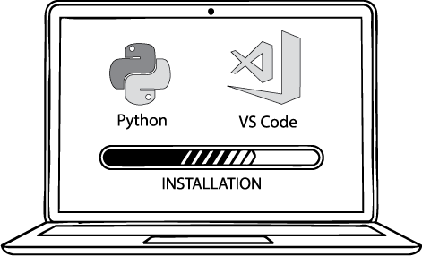

# MODULE 1: INSTALL VS CODE AND PYTHON EXTENSION

#### The goal of this module is to get your computer ready to write and run Python code.

#### Setup

1. **Install Python**
   1. Download from [python.org](https://www.python.org/downloads/)
   2. Check "Add Python to PATH" during installation.
2. **Install Visual Studio Code (VS Code)**
   1. Download from https://code.visualstudio.com/
3. **Install the Python Extension in VS Code**
   1. Open VS Code → Extensions tab (or `Ctrl+Shift+X`) → Search "Python" → Click **Install**
4. **Verify Python Is Installed**
   1. Open Terminal in VS Code (`Ctrl + backtick`)
   2. Type: `python --version` or `python3 --version`

> [!NOTE]
>
> To open the terminal in VS code, type (`Ctrl + backtick`) or go to the top menu → **View → Terminal**.

