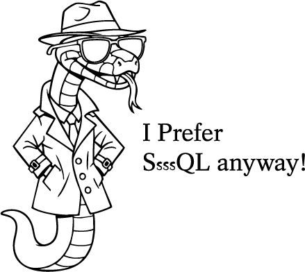

# WHO IS PYTHON FOR?

**Python is for anyone who wants to solve problems with code** — from total beginners to seasoned professionals. Its users include students, educators, technical writers, data analysts, scientists, web developers, and hobbyists alike. In short, Python is for everyone... well, except actual snakes.

